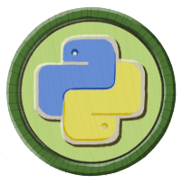

<h1>👋 Hi, I’m Alizéa Lebaron</h1>

<h2>🏛️ Ancien tronc commun (< Décembre 2025)</h2>

| Logo | Titre | Description | Technologies |
| :---: | :--- | :--- | :---: |
|  | **[Libft](https://github.com/alizealebaron/libft)** | Ma première librairie en C. | `C` |
|  | **[Get_next_line](https://github.com/alizealebaron/get_next_line)** | Apprendre à lire les fichiers en C. | `C` |
|  | **[Born2beroot](https://github.com/alizealebaron/Born2beroot)** | Mise en place d'une machine virtuelle. | `Debian` |
|  | **[Ft_printf](https://github.com/alizealebaron/ft_printf)** | Reproduction de la fonction printf. | `C` |
|  | **[Push_swap](https://github.com/alizealebaron/push_swap)** | Apprendre à trier efficacement les piles. | `C` |
|  | **[So_long](https://github.com/alizealebaron/so_long)** | Un premier essaie de jeu vidéo simple. | `C` |

<h2>✨ Nouveau tronc commun (> Décembre 2025)</h2>

| Logo | Titre | Description | Technologies |
| :---: | :--- | :--- | :---: |
|  | **[Python_Module](https://github.com/alizealebaron/python_module)** | 11 modules pour apprendre python. | `Python` |
|  | **[A_maze_ing](https://github.com/alizealebaron/a_maze_ing)** | Génération de labyrinthe en python. | `Python` |
|  | **[Codexion](https://github.com/alizealebaron/codexion)** | Gérer un problème avec des threads. | `C` |

---

## 🛠️ Langages et Outils

---

<h2>Stats</h2>
    <table style="height: 100%; width: 100%;">
        <tr style="height: 50%;">
            <td style="vertical-align: stretch; height: 100%;">
                
            </td>
            <td style="vertical-align: stretch; height: 100%;">
                
            </td>
        </tr>
        <tr style="height: 50%;">
            <td style="vertical-align: stretch; height: 100%;">
                
            </td>
            <td style="vertical-align: stretch; height: 100%;">
                
            </td>
        </tr>
    </table>

---
*Dernière mise à jour : Février 2026*

<!---
alizealebaron/alizealebaron is a ✨ special ✨ repository because its `README.md` (this file) appears on your GitHub profile.
You can click the Preview link to take a look at your changes.
--->
