

	<h1>👋 Hi, I’m Alizéa Lebaron</h1>

## À propos de moi

Actuellement étudiante à 42 Le Havre, j'aime découvrir et apprendre à maîtriser de nouveaux langages de programmation. J'apprécie tout particulièrement le développement web et les langages de programmation orientés objets.

## Mes compétences

## Mes projets

  <em>Une sélection de projets réalisés pendant mon parcours à 42 Le Havre et en BUT Informatique.</em>

<table align="center">
  <tr>
    <td align="center"><strong>15</strong> Projets 42</td>
    <td align="center"><strong>3</strong> Projets BUT</td>
    <td align="center"><strong>13</strong> Technologies explorées</td>
  </tr>
</table>

<h3 style="display: inline;">Cursus 42 · 15 projets</h3>

<h4>🏛️ Ancien tronc commun (avant décembre 2025)</h4>

| Logo | Titre | Description | Technologies |
| :---: | :--- | :--- | :---: |
|  | **[Libft](https://github.com/alizealebaron/libft)** | Ma première librairie en C. | `C` |
| 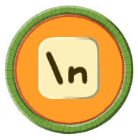 | **[Get_next_line](https://github.com/alizealebaron/get_next_line)** | Apprendre à lire les fichiers en C. | `C` |
| 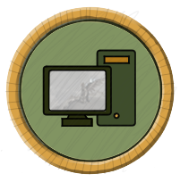 | **[Born2beroot](https://github.com/alizealebaron/Born2beroot)** | Mise en place d'une machine virtuelle. | `Debian` |
| 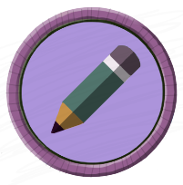 | **[Ft_printf](https://github.com/alizealebaron/ft_printf)** | Reproduction de la fonction printf. | `C` |
|  | **[Push_swap](https://github.com/alizealebaron/push_swap)** | Apprendre à trier efficacement les piles. | `C` |
| 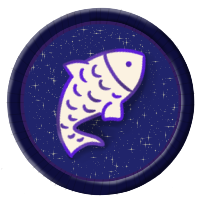 | **[So_long](https://github.com/alizealebaron/so_long)** | Un premier essai de jeu vidéo simple. | `C` |

<h4>✨ Nouveau tronc commun (à partir de décembre 2025)</h4>

| Logo | Titre | Description | Technologies |
| :---: | :--- | :--- | :---: |
| 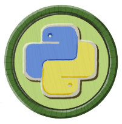 | **[Python_Module](https://github.com/alizealebaron/python_module)** | 11 modules pour apprendre Python. | `Python` |
|  | **[A_maze_ing](https://github.com/alizealebaron/a_maze_ing)** | Génération de labyrinthe en Python. | `Python` |
| 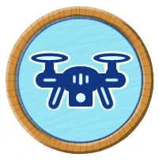 | **[Fly-in](https://github.com/alizealebaron/fly-in)** | Optimisation d'algorithmes dans un graphe. | `Python` |
|  | **[Call_me_maybe](https://github.com/alizealebaron/call_me_maybe)** | Introduction aux LLM. | `Python` |
| 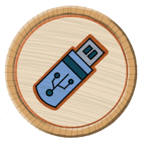 | **[Codexion](https://github.com/alizealebaron/codexion)** | Gérer un problème avec des threads. | `C` |
| 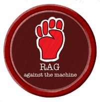 | **[RAG against the machine](https://github.com/alizealebaron/RAG_against_the_machine)** | Développement d'un RAG. | `Python` |
| 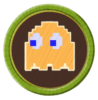 | **[Pac_man](https://github.com/alizealebaron/pac_man)** | Recréer un jeu mythiquement connu. | `Python` |
| 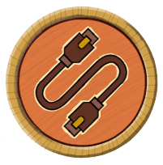 | **[NetPractice](https://github.com/alizealebaron/netPractice)** | Configuration d'un petit réseau. | `Réseau` |
|  | **[The_Answer_Protocol](https://github.com/alizealebaron/the_answer_protocol)** | Une aventure textuelle dans un univers partagé. | `Go` |
| 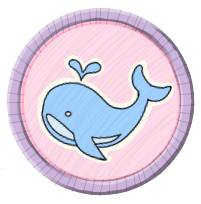 | **[Inception](https://github.com/alizealebaron/inception)** | Apprendre à utiliser Docker. | `Docker` |

<h3 style="display: inline;">BUT Informatique · 3 projets</h3>

| Titre | Description | Technologies |
| :--- | :--- | :---: |
| **[Malen](https://github.com/alizealebaron/Malen)** | Reproduire Paint en Java. | `Java` |
| **[ASTRE](https://github.com/alizealebaron/ASTRE)** | Développer une première application utilitaire en Java. | `Java` |
| **[CinkeTera](https://github.com/alizealebaron/CinkeTera)** | Reproduire un jeu de plateau à l'aide de Java. | `Java` |

## Mes statistiques

    
    

## Contactez-moi !

  
  
   
  

